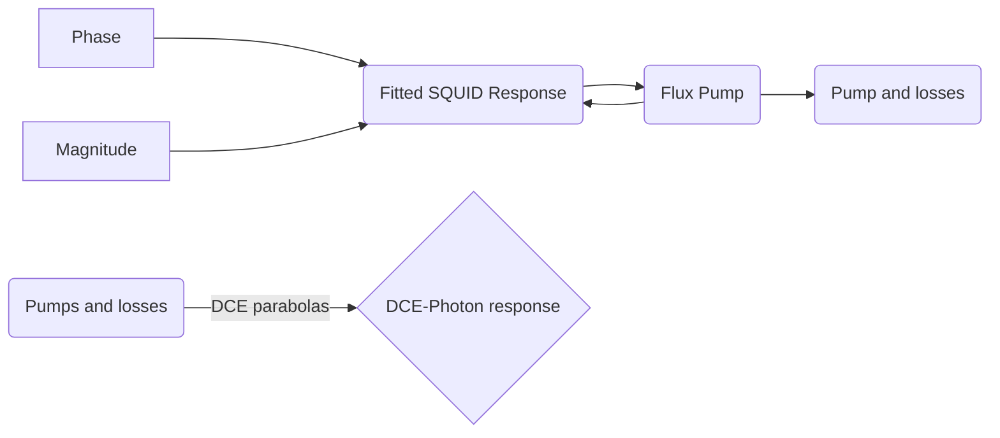

# DCE simulation script

## Why: Two things: 

- 1. To verify our current understanding on the DCE  and compare it with the measured data.
- 2. To quantify the non-linearity in the system.
- 3. Approximate response of the SQUID to the second order.
$$ I_C = 2 I_0 |\cos(\pi \frac{\Phi_a}{\Phi_0})|$$

$$H = \frac{1}{2} \sum_{i=1}^\infty (\frac{P_i^2}{\Delta x C_0} +\frac{(\Phi_{i+1} - \Phi_i)^2}{\Delta x L_0}) + \frac{1}{2} \frac{P_1^2}{C_J} + \frac{1}{2}(\frac{2 \pi}{\Phi_0})^2 E_J(\Phi_{ext} \Phi_1^2) $$ (J. R. Johansson et al.: Phys. Rev. A 82, 052509 (2010))

## What this script does:
	
- 1. Takes the SQUIDs non-linear phase response as a function of magnetic flux.
- 2. Creates a magnetic flux offset plus a sinusoidal change emulating a Flux signal.
- 3. Obtains phase response values corresponding to that Flux signal from (1)
- 4. (Similarly Obtains loss response values from the magnitude response.)
- 5. Calculates Frequency components of this phase response.
- 6. Multiplies these frequency components with a parabola expected by DCE.
- 7. Adds calculated losses due to frequencies above the superconducting gap frequency and the loss response values from the SQUID's magnitude response.

## How:
- [phase_res.py](https://github.com/benschneider/Sim_DCE/blob/master/phase_res.py), runs the simulation.
-  The Phase and Loss responses where obtained from measurement (presented in the paper in Fig.2c). The corresponding data files included are: **SQUID_phase.dat** and **SQUID_magnitude.dat**

- Both responses are then fitted using the python script.

